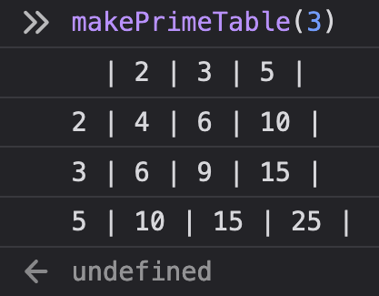

# Prime Tables 🧩

2️⃣  3️⃣  5️⃣  7️⃣  1️⃣1️⃣  1️⃣3️⃣  1️⃣7️⃣  1️⃣9️⃣  2️⃣3️⃣   🔮

This application takes numeric input (N) from a user and outputs a multiplication table of (N) prime numbers.
Programming used for the project: `JavaScript`

### How to run the application 🎲

The user gives a number in the input field and presses `Enter`. The application outputs a **(N+1) x (N+1) grid of numbers**.

## STAGES 🧱

I tried to separate each task to a different function. This way testing is easier and more effective. 🔬

The application was built in the following stages:

- CONSOLE stage 🖥

  - I first created a prime numbers generator function `primeNumbersGenerator()`. This is an iterable entity that outputs prime numbers. It checks if an integer is divisible by 1 or itself, and registers it as **prime** with `yield`. 🌾
  - The next function `giveNPrimeNumbers()` iterates the generator with upper limit an input `N`, that is the argument of the function itself. It returns an array `primesArr` with the first `N` primes, plus an extra empty slot at the beginning. 📥
  - I devised the `makePrimeTable()` function, to output the table on the console. The formatting is achieved through a _string variable_ `rowOutput` that serves as each row of the array. The first row is populated with the original output of primes from the `giveNPrimeNumbers()`, separated by the `|` character. Each subsequent row is populated with the multipliers of each one of the same prime numbers with every other one in the array.
  - The result for an input N = 3️⃣ is: 
    | 2 | 3 | 5 | 
    2 | 4 | 6 | 10 | 
    3 | 6 | 9 | 15 | 
    5 | 10 | 15 | 25 | 

  - Screenshots for other inputs 🧮

    

    

- APPLICATION stage 🟪 🟧 🟨

  - The main decision I have to make for this stage is if I would just create an element and output the console result as a text, **or** something more visually pleasing, such as presenting the results in an actual table, using the `<table>`. 🧰
  - My first approach was to create the `makePrimeTableHTML()` function (commented out in the _script.js_). This was a slightly modified version of `makePrimeTable()`, that was just presenting the console formatted result in an HTML page. The presentation was not very efficient this way, as a layout problem was created through the use of `white-space: pre;` in the CSS. The `white-space: pre;` was necessary to parse the `new line` character through the `.textContent` method in js.
  - My second - and final - approach was the function `primeTable()`. ✨ Its task is the same as in the case of `makePrimeTable()` and `makePrimeTableHTML()`, but this time the DOM is being manipulated. I create a `TABLE` according to the given `N` number, in which I present the results. This function is called by the `createTable()` function, which is triggered once the input number is submitted through the `form`.

## Coming soon ...

### TESTING 🧪
